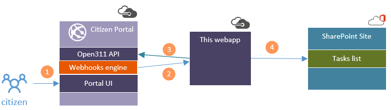
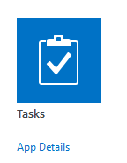
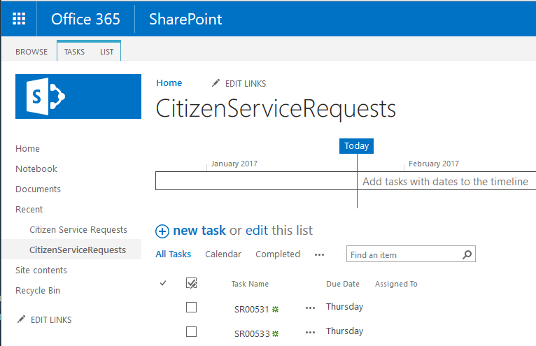

# Citizen Services: Webhook and API integration with SharePoint Online
This project contains sample code to demonstrate the usage of the webhooks and APIs in AvePoint Citizen Services to integrate with a remote system.

This example solution is middleware that uses webhooks to respond to an event from the Citizen Portal and pass relevant information to SharePoint Online. The workflow of the sample is as the following:

1. A citizen submits a service request using the Citizen Portal.
2. The webapp URL has been registered as a webhook for the "A new service request is submitted" event in the Citizen portal. The webhook will be called after the new service request is submitted by the citizen.
3. The webapp uses the information passed in the webhook call to make an Open311 API call to the Citizen Portal to retrieve details of the service request.
4. The webapp uses the service request information to create a new task item in a SharePoint Online task list. SharePoint can then be used to track the task.



To build and run the sample, you must first prepare the following:

* Get your Citizen service portal URL and API endpoint. This will be in the format of "https://api.citizenservices.org/**your_tenant_name**/api" 
* Get a SharePoint site and create a Tasks list. If you are using Office 365 SharePoint Online, you can simply add a new APP in the Site Contents and choose the "Tasks" App to add. 



* Update the web.config in the sample with your SharePoint site URL and Tasks list name.


``` XML
    <!--
        configuration of the SharePoint task list
    -->
    <add key="SharePointSite" value="your_SharePoint_Site_URL"/>
    <add key="SharePointUser" value="your_sharepoint_user"/>
    <add key="SharePointUserPassword" value="your_SharePoint_password"/>
    <add key="TaskList" value="your_SharePoint_task_list_name"/>
    <!--
        API URL to access the Open311 webservice on your AvePoint Citizen Services tenant
    -->
    <add key="APIAddress" value="https://api.citizenservices.org/your_tenant_name/api"/>
```

The webapp uses the code below to make call to the Citizen Portal API to get request details after the webhook is called.

``` C#
        private async Task<ServiceRequest> GetServiceRequest(string id)
        {
            using (HttpClient client = new HttpClient())
            {
                string apiAddress = ConfigurationManager.AppSettings["APIAddress"];

                string requestUrl = apiAddress + $"/beta/requests/{id}.json";

                string requestJson = await client.GetStringAsync(requestUrl);

                return JsonConvert.DeserializeObject<ServiceRequest>(requestJson);
            }
        }
```

And then it uses the code below to send a request to SharePoint to create a new task item:

``` C#

        private async Task<ServiceRequest> GetServiceRequest(string id)
        {
            using (HttpClient client = new HttpClient())
            {
                string apiAddress = ConfigurationManager.AppSettings["APIAddress"];

                string requestUrl = apiAddress + $"/beta/requests/{id}.json";

                string requestJson = await client.GetStringAsync(requestUrl);

                return JsonConvert.DeserializeObject<ServiceRequest>(requestJson);
            }
        }
```

The screenshot below shows an example of new teask items created in SharePoint Tasks list:




